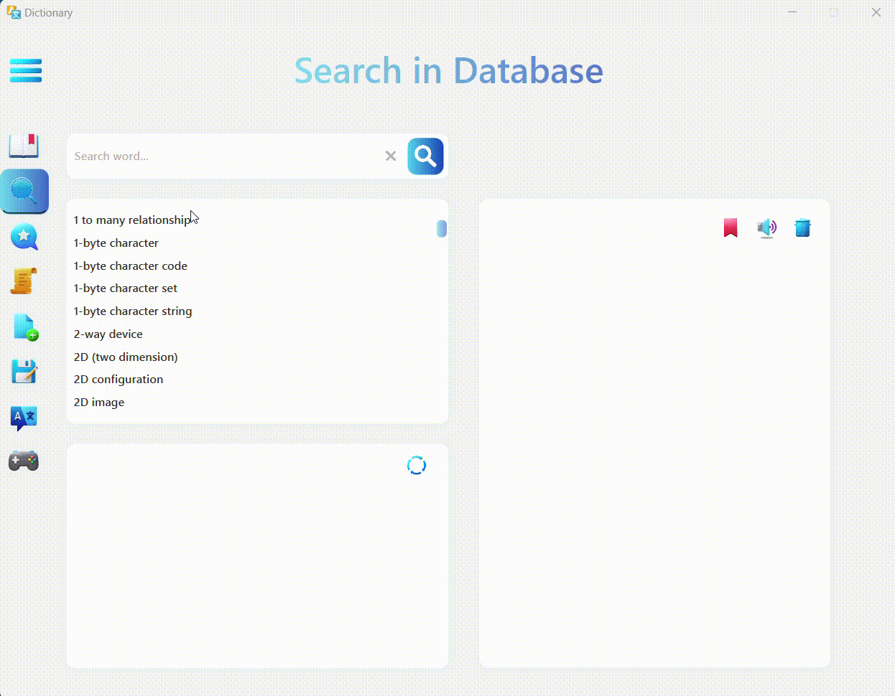
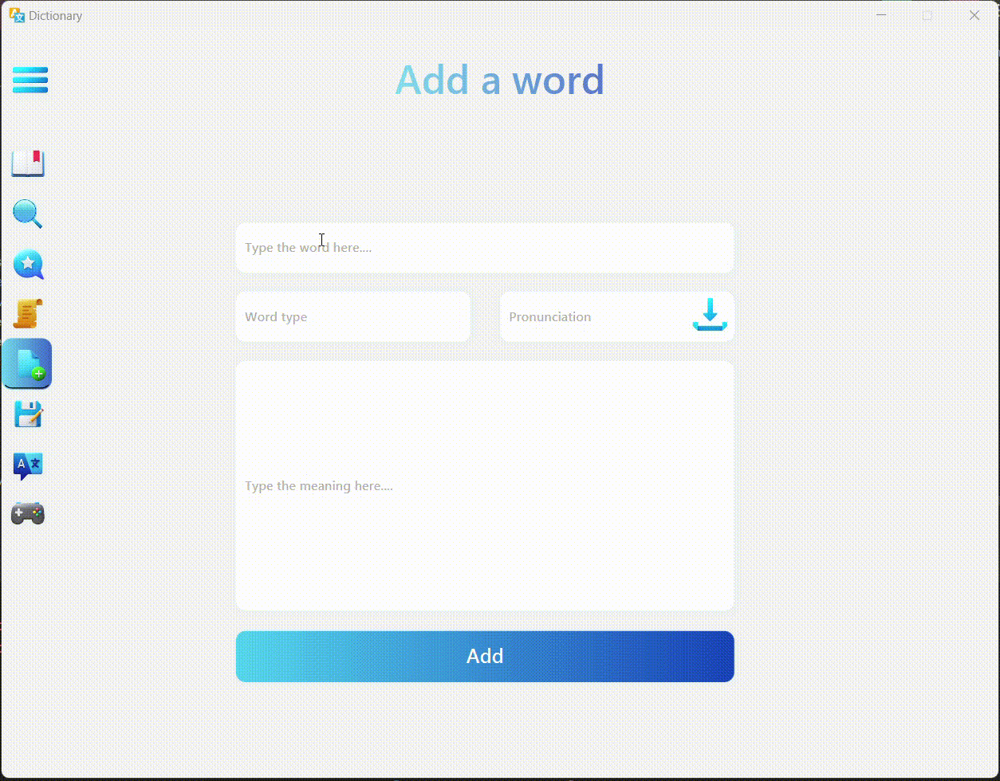
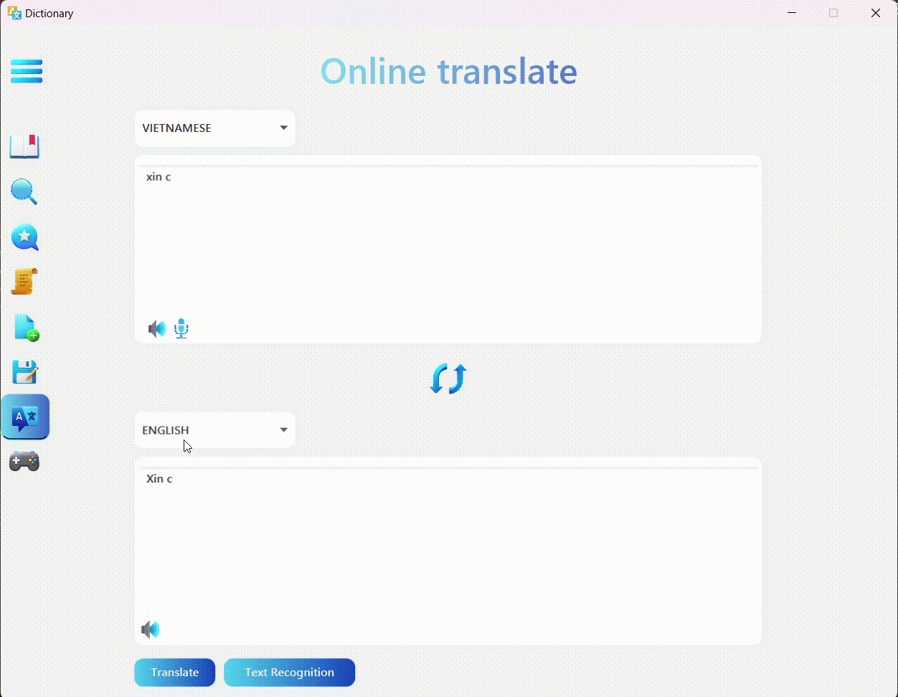
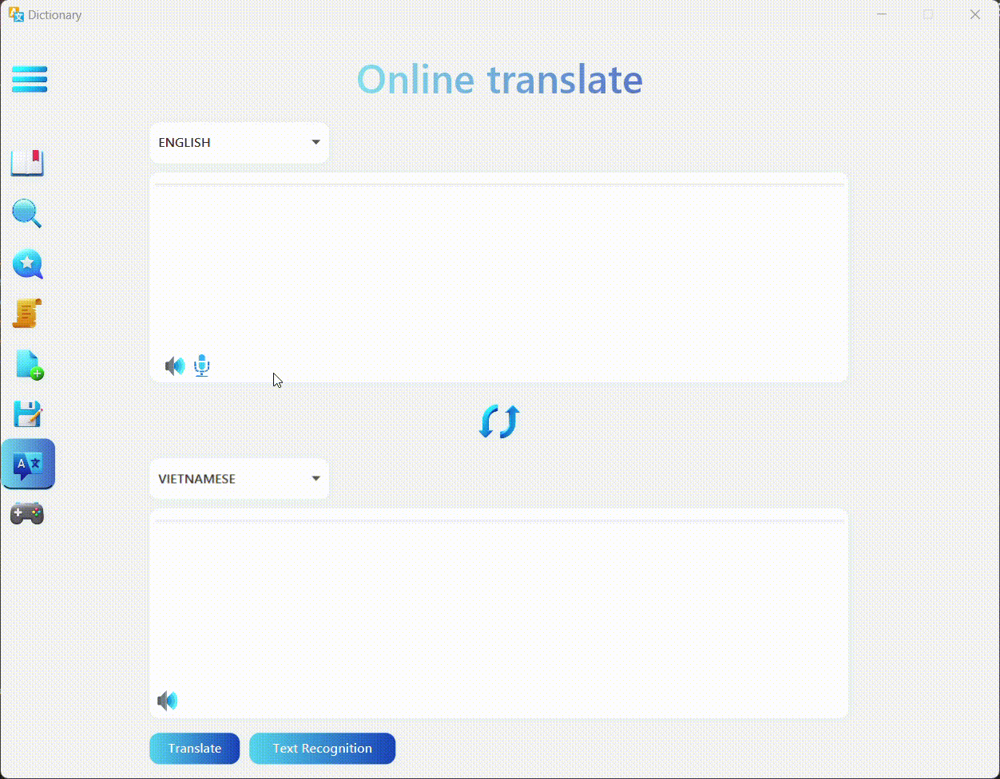
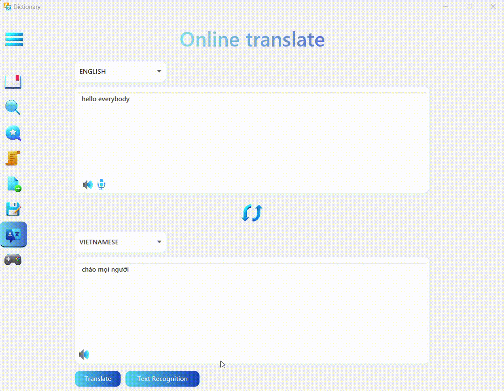
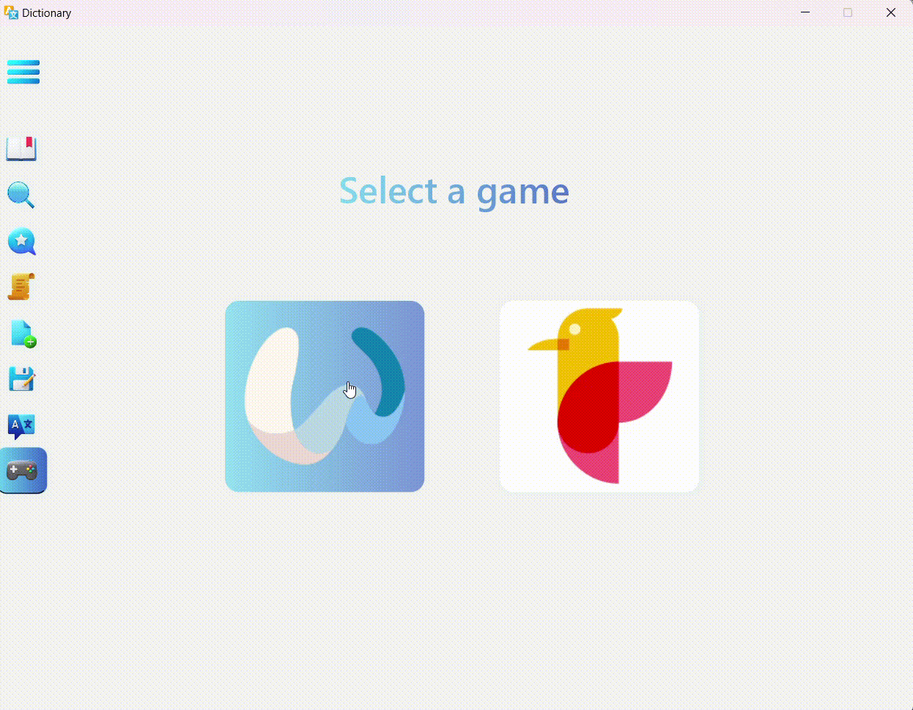
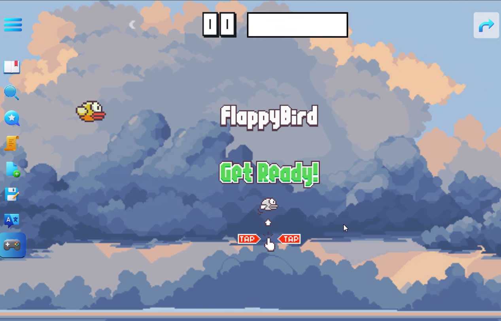

# Dictionary Project 

## Overview

Team members:
- Nguyễn Hữu Dũng: 22028076 - https://github.com/Dzungthez
- Lâm Nguyễn Duy Phong: 22028164 - https://github.com/DuyPhongRev

Halo peeps, this is our Dictionary Project! We have built a basic, user-friendly but feature-rich dictionary application.
The application itself has been built using JavaFX and SceneBuilder. In addition to that, we use several APIs to enhance the application's functionality. (One of them is made by us).
1. **Search Word**: Users can search for vocabulary from a SQL offline database that contains ~130k words. The definition tab displays the word's definition, and the example tab displays the word's definition, pronunciation, context of use, and example sentences. The application also includes a pronunciation feature that allows users to listen to the correct pronunciation of a word. A synonym tab (powered by Online APIs) that lists many close-related words aside from the one you've searched for. 

2. **Add Word**: Users can add new words to the database. There is a "generate" button. The application will automatically generate the pronunciation in case you get stuck with it.

3. **Edit Word**: Users can edit a existing word from the database.

4. **Online translate**: Users can use the online translate tab to search words online. This aims to help user can access a much larger online resources whenever they have a stable internet connection.

5. **Voice translate**: Users can click the micro button and speak the word they want to know the meaning. The application can detect user's voice and do translate it into the target language.

6. **Image translate **: Users can choose a picture and let the application detect possible texts, translate it into Vietnamese.

7. **Gaming**: We created two funny games - wordle and modified flappy bird, aiming at users who want to make fun while learning, and make them stick with the app :D
## Demo

### Search Word

### Adding Word

### Online Translate
We use the Google Translate API to translate the text. The following is a demo of the text translation feature. You can translate the word back and forth between English, Spanish, French, Vietnames.

### Translate Voice
We use the Whisper Model and then fine-tuning to make it faster. We use model type Base.en.

### Translate Image
We write a simple api based on flask that runs locally. We use pytesseract libarary in Python to detect text, then write the translated text back to the image.

### Wordle Game

### Modified Flappy Bird Game

